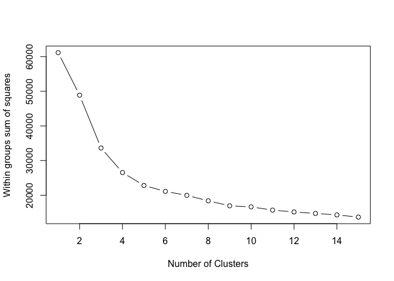

# Number26 Project: Clustering Analysis.
Igor Telezhinsky  
2016-02-24  


# Context

Task 1 can be solved with the clustering analysis - a subject of unsupervised learning. Most frequently used algorithm is *k-means*. One problem is that one must set the number of clusters in advance. Here I will perform the analysis to find out what is the most plausible number of clusters for this training data set. I will use the result of the analysis to do k-means clustering on the given data set.

# Data Selection, Transformation and Exploration

## Data selection

Original data consist of 10 variables. To perform clustering analysis we need evaluate distances, therefore *character*/categorical variables need to be treated in numeric way. I need to select which ones to keep and transform and which ones leave out. To recognize patterns in user data base, I think that following variables will not be needed:  
1. *id*, which is a unique hash  
2. *birthPlace*, which in many cases entered not in a specific way, i.e., various spellings of one place, or countries and towns mixed together  
3. *lastName* - again mostly unique  
4. *passportType* - has a lot of missing values and again entered not in a specific way, i.e., different names for the same kind of document  
The variable *nationality* is a useful one and will be kept and transformed to numeric type.

## Data Transformation and Exploration

The time stamps in the data set are given in UNIX date format (number of milliseconds elapsed from 1970-01-01) and therefore represent very large integers. They need to be scaled (standardized) in order not to dominate the variance in the data set. The variable *nationality* can be transformed to *nationalityId*: there are 120 nationalities so each can be assigned an integer value. There are two ways to do it: based on *alphabetical* sorting and based on *frequency of occurance* in the data set. During exploratory analysis it was found that based on *frequency of occurance* id assignment shows better/more stable results. After assignment of integer values, we also need to transform this variable because it spans a wide range of values compared to other variable and it's distribution is very skewed. There are several ways I tried:  
1. scaling (standardizing)  
2. log transformation  
3. log transformation + scaling (standardizing)  
4. Box Cox transformation  
5. Box Cox transformation + scaling (standardizing)  
Methods 4(5) gave same result as 2(3), therefore I stayed with method 2: this way the span of values reduces from 1-120 to 0-~5, which is fine.

Finally, we can scale(standardize) not only time stamps, but also all variables. This was tried as well.

With all possible transformations described, the exploratory analysis similar to what is described below was performed and the final transformations were selected as follows:  

1. Scale (standardize) time variables
2. Assign integer id to *nationality* based on *frequency of occurance*  
3. Log transform new *nationalityId* variable.

The data is read in and transformed in described above way with the following functions:


```r
dt<-readDT()
df_nIdl<-convert(dt,operations = c("numNatId","scaleTimes","logNatId"))
```

# Analysis: Scaled Times, Log of *nationlalityId*

Here I perform the analysis on the data that has 6 variables: 3 scaled (standardized) time stamp columns, gender, signupComplete and log transformed *nationlalityId* variable. I will call this data set *transformed* in subsequent analysis as opposed to PCs data set created below. 

## Principal Components (PCs) Analysis
After looking at *tranformed* data I decided to perform PCA to understand how many PCs to select and see if there are any vivid clustering in PCs space. PCs may help in identifying clusters as they reduce data dimensionality and make data more comprehensible.


```r
analysePC(df_nIdl)
```

 

```
## Importance of components:
##                           Comp.1    Comp.2    Comp.3     Comp.4     Comp.5
## Standard deviation     1.3386325 1.0324569 0.9523564 0.55370975 0.39368918
## Proportion of Variance 0.4102789 0.2440621 0.2076613 0.07019736 0.03548652
## Cumulative Proportion  0.4102789 0.6543410 0.8620022 0.93219959 0.96768611
##                            Comp.6
## Standard deviation     0.37567857
## Proportion of Variance 0.03231389
## Cumulative Proportion  1.00000000
```

```r
df_nIdl_pc<-pcdf(df_nIdl)
```

I see that the first 3 PCs explain 86% and first 4 PCs explain 93% of variance. In the following analysis of the expected number of clusters I will choose in most cases 4 PCs, however I analysed also cases including from 3 up to all 6 PCs during exploratory analysis phase.   

## Number of cluster analysis
Here I perform the analysis to understand the optimal number of clusters within data set. I will perform the analysis on the PCs data set taking just components explaining >85% of variance and also on the *transformed* data set chosen for the current analysis.

## K-means "elbow".

By looking at the plot of within cluster sum of squared error (SSE) one can choose the optimal number of clusters by the location of the "elbow".

### PCs data set:


```r
analyseKM(df_nIdl_pc,4,4,default=T)
```

```
## [1] "Nr.of components used: 4"
```

 

This plot suggest ~5 clusters. Plots with 3,4,5,6 PCs look similar.

### Transformed data set:

For the *tranformed* data set I need all variables:

```r
analyseKM(df_nIdl,6,6,default=T)
```

```
## [1] "Nr.of components used: 6"
```

 

This plot also suggest ~5 clusters.

## CLARA's silhuoette

This is from wiki: "The silhouette of a datum is a measure of how closely it is matched to data within its cluster and how loosely it is matched to data of the neighboring cluster". I use here k-medoid method based on PAM but used for large data sets and called CLARA (PAM was too slow on my computer). Due to random samplings out of data, it is not deterministic (I do not set seed because I am interested in different outcomes)

### PCs data set:


```r
analyseCL(df_nIdl_pc[,1:3])
```

```
## [1] "Best Nr. of clusters: 5"
```

 

On 3 PCs, the maximum was always at 5 clusters. If I add more PCs, the outcome varies.

### Transformed data set:


```r
analyseCL(df_nIdl)
```

```
## [1] "Best Nr. of clusters: 6"
```

 

Here as well, the outcome is not stable. Lines show mean and one standard deviation band.

## Calinski method
Calinsky criterion is another approach to diagnosing how many clusters suit the data.

### PCs data set:


```r
analyseCM(df_nIdl_pc[,1:4])
```

 

```
## Calinski criterion optimal number of clusters: 5
```

Changing the number of PCs to 3(5) changes the number of clusters to 4(6). I tend to think the result is 5 clusters.

## Tranformed data set


```r
analyseCM(df_nIdl)
```

 

```
## Calinski criterion optimal number of clusters: 5
```

Here we get 5 clusters same as with 4 PCs.

## Expectation-maximization

Determine the optimal model and number of clusters according to the Bayesian Information Criterion for expectation-maximization, initialized by hierarchical clustering for parameterized Gaussian mixture models: [stackoverflow](http://stackoverflow.com/questions/15376075/cluster-analysis-in-r-determine-the-optimal-number-of-clusters).

### PCs data set:


```r
analyseEM(df_nIdl_pc[,1:3])
```

```
## model-based optimal number of clusters: 8
```

 

All 3,4,5 PCs have same result: 8 clusters. I show here 3 PCs plots because they have most vivid "elbow", which in my opinion is at 5 clusters.

## Transformed data set:


```r
analyseEM(df_nIdl)
```

```
## model-based optimal number of clusters: 5
```

 

The plot is not nice, but the outcome is 5 clusters.

# Producing cluster classes

The analysis above shows that most probably there are 5 clusters in the data. Let's apply k-means with k=5 first to PCs data set and then to *transformed* data set.

## PCs data set:


```r
kmClpcs <- kmeans(df_nIdl_pc[,1:4], 5, nstart=25, iter.max=1000)
```


```r
kmCltrd <- kmeans(df_nIdl, 5, nstart=25, iter.max=1000)
```

## Visualisation

### PCs data set:

```r
palette(alpha(brewer.pal(9,'Set1'), 0.5))
plot(df_nIdl_pc[,1:4], col=kmClpcs$clust, pch=16)
```

 

### Transformed data set:

```r
palette(alpha(brewer.pal(9,'Set1'), 0.5))
plot(df_nIdl, col=kmCltrd$clust, pch=16)
```

 

### Transformed data set: classes from PCs

Note: class colors do not coincide, but clusterisation *does* coincide, suggesting that PCs did not worse job than full transformed data set. I will use, however, for the further analysis classes obtained from the full transformed data set.


```r
palette(alpha(brewer.pal(9,'Set1'), 0.5))
plot(df_nIdl, col=kmClpcs$clust, pch=16)
```

 

### function to add cluster id to data set


```r
bindClusterId<-function(df)
{
    kmCl <- kmeans(df, 5, nstart=25, iter.max=1000)
    df<-cbind(df,clusterId=kmCl$clust)
}
```

# Final remarks

In order *bindClusterId()* function to work, all the required transformations to the data set must be made beforehand. You can add *clusterId* to my training data set with the following code.


```r
dt <- readDT()
df <- convert(dt,operations = c("numNatId","scaleTimes","logNatId"))
dfClusterId<-bindClusterId(df)
str(dfClusterId)
```
